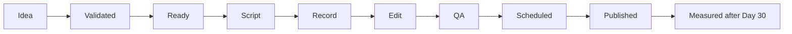

# IT an Kreyòl

> Teknoloji klè. An kreyòl. Pou tout moun.
> Clear technology education in Haitian Creole, built in public.

[](PROJECT_STATUS.md)
[](docs/04-roadmap.md)
[](docs/02-methodology.md)
[](https://github.com/edcadet10/it-an-kreyol/actions/workflows/validate.yml)

## Sa n ap bati / What we are building

`IT an Kreyòl` is an educational TikTok series that explains practical information technology in Haitian Creole. The repository is also a working project-management portfolio: every major artifact—from the charter and work breakdown structure to the risk register and evaluation plan—is visible and connected to the work.

The first release is deliberately simple: **30 beginner-focused videos on 30 consecutive days**. Audience-performance analytics will not be evaluated during those 30 days. After video 30, the project moves into a defined measurement and review phase.

This is a learning project, not a source of personalized legal, financial, medical, or security advice. Security demonstrations must use test accounts and sanitized data.

## Current status

- Phase: initiation and planning
- Release target: 30 videos on 30 consecutive days
- Audience hypothesis: Haitian Creole-speaking beginners, including people in Haiti and the diaspora
- Delivery approach: stage-gated project governance with a Kanban content-production flow
- Performance-measurement status: **not started; blackout applies on challenge days 1–30**
- License: not yet selected; until a license is added, reuse rights are not granted

See the live [project status](PROJECT_STATUS.md), [30-day roadmap](docs/04-roadmap.md), [Release 1 milestone](https://github.com/edcadet10/it-an-kreyol/milestone/1), and [working issue backlog](https://github.com/edcadet10/it-an-kreyol/issues).

## Project map

| If you want to understand... | Read... | Project-management concept |
|---|---|---|
| Why this project exists and what success means | [Project charter](docs/01-project-charter.md) | Initiation and authorization |
| Why this method was selected | [Delivery methodology](docs/02-methodology.md) | Tailoring and life-cycle choice |
| Exactly what is and is not included | [Scope and WBS](docs/03-scope-and-wbs.md) | Scope baseline and decomposition |
| When work happens and where decisions occur | [Roadmap](docs/04-roadmap.md) | Schedule, milestones, and gates |
| Who matters and how communication works | [Stakeholders and communications](docs/05-stakeholders-and-communications.md) | Engagement and governance |
| What could go wrong | [Risk register](docs/06-risk-register.md) | Uncertainty and response planning |
| What “good enough to publish” means | [Quality plan](docs/07-quality-management.md) | Quality planning and control |
| What happens after video 30 | [Measurement and experiments](docs/08-measurement-and-experiments.md) | Benefits and evidence |
| Time, money, tools, and capacity | [Resources and budget](docs/09-resources-and-budget.md) | Resource and cost baselines |
| How to learn project management from this repo | [Learning guide](docs/10-project-management-learning-guide.md) | Applied PM curriculum |
| Which beliefs and choices may change | [Assumptions and decisions](docs/11-assumptions-and-decisions.md) | Decision traceability |
| How the plan was challenged before publication | [Disconfirmation audit](research/disconfirmation-audit.md) | Pre-mortem testing and evidence boundaries |
| What the 30 videos will teach | [Curriculum map](content/30-day-series/curriculum-map.md) | Product scope and backlog |

## How work moves



Only two videos may be in `Script` through `QA` at once. Before Day 1, at least seven videos should be in `Scheduled` or an equivalent ready-to-post state. Details are in the [methodology](docs/02-methodology.md).

## Repository structure

```text
.
├── .github/                 GitHub contribution and issue forms
├── content/30-day-series/   Curriculum, backlog, and episode briefs
├── data/                    Blank, version-controlled measurement schemas
├── docs/                    Project-management baselines and registers
├── research/                Evidence register and source notes
├── templates/               Reusable production and review forms
├── CONTRIBUTING.md
├── PROJECT_STATUS.md
└── README.md
```

Raw video, private participant information, credentials, and unpublished analytics exports must not be committed. The `.gitignore` excludes dedicated local folders for those materials.

## Working agreements

1. Explain one useful idea per video.
2. Speak naturally in Haitian Creole; show the English industry term when it helps employability or search.
3. Verify technical and security claims against primary sources.
4. Manually review captions, pronunciation, on-screen text, and examples.
5. Never display real passwords, private messages, account details, IP addresses, or personal data.
6. During days 1–30, publish consistently and do not optimize from performance analytics.
7. Correct material errors even during the analytics blackout; safety outranks experiment purity.

## Contributing

Feedback from Haitian Creole speakers, learners, educators, and IT practitioners is welcome. Read [CONTRIBUTING.md](CONTRIBUTING.md) before opening an issue or pull request. Language and technical corrections should include the episode ID and a source or explanation when possible.

## Source policy

The project prefers primary sources such as standards bodies, government cyber guidance, official platform documentation, and original technical documentation. Haitian Creole terminology begins with established usage and the [MIT-Haiti STEM glossary](https://haiti.mit.edu/glossaryglose/), but that glossary describes itself as dynamic rather than prescriptive; audience and expert feedback remain part of quality review.

Research used to design the project is recorded in the [evidence register](research/evidence-register.md).
